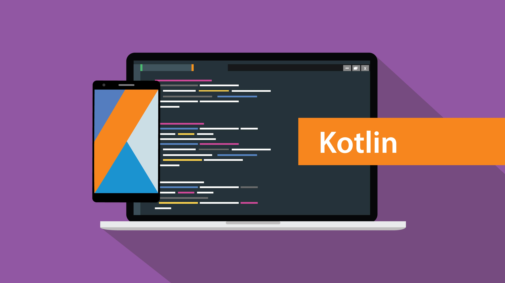

 

    

A kotlin multiplatform library to manage sockets with support for both iOS & Android

 

## How it works

## License

This software is licensed under the MIT license. See [LICENSE](./LICENSE) for full disclosure.
